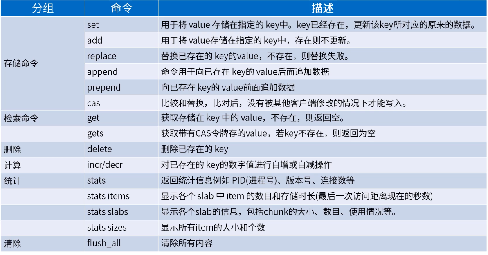

[TOC]

# memcache入门

### Memcache简介

memchache是一个免费的，高性能的，具有分布式内存对象的缓存系统，它通过减轻数据库负载加速动态web应用。

1. 本质上就是一个内存key-value缓存。
2. 协议简单，使用的是基于文本行的协议。
3. 不支持数据的持久化，服务器关闭之后数据全部丢失。
4. Memcache简洁而强大，便于快速开发，上手较为容易。
5. 没有安全机制，请不要暴露到互联网。

### Memcache设计理念

1. 简单的键/值存储。

   服务器不关心你的数据是什么样的，只管数据存储。

2. 服务端功能简单，很多逻辑依赖客户端实现。

   客户端专注如何选择读取或写入的服务器，以及无法联系服务器时要执行的操作。

   服务器专注如何存储和管理何时清除或重用内存。

3. Memcache实例之间没有通信机制。

4. 每个命令的复杂度为O(1)。

   慢速机器上的查询应该在1ms以下运行。高端服务器的吞吐量可以达到每秒数百万。

5. 缓存自动清除机制。

6. 缓存失效机制。

### 常用命令



### 安装

```java
yum install libevent-devel
wget https://memcached.org/latest
tar -zxvf memcached-1.5.12.tar.gz
cd memcached-1.5.12
./configure --prefix=/usr/local/memcached
make && sudo make install

‐p <num> 监听的TCP端口(默认: 11211)
‐U <num> 监听的UDP端口(默认: 11211, 0表示不监听)
‐l <ip_addr> 监听的IP地址。（默认：INADDR_ANY，所有地址）
‐d 作为守护进程来运行
‐u <username> 设定进程所属用户（仅root用户可以使用）
‐m <num> 所有slab class可用内存的上限（默认：64MB）
‐v 提示信息（在事件循环中打印错误/警告信息。）
‐vv 详细信息（还打印客户端命令/响应）
‐vvv 超详细信息（还打印内部状态的变化）
```

### 使用

1. 命令行。

```java
# 启动
usr/local/bin/memcached -p 11211 -u root -vv
slab class   1: chunk size        96 perslab   10922
slab class   2: chunk size       120 perslab    8738
slab class   3: chunk size       152 perslab    6898
slab class   4: chunk size       192 perslab    5461
slab class   5: chunk size       240 perslab    4369
slab class   6: chunk size       304 perslab    3449
slab class   7: chunk size       384 perslab    2730
slab class   8: chunk size       480 perslab    2184
slab class   9: chunk size       600 perslab    1747
slab class  10: chunk size       752 perslab    1394
slab class  11: chunk size       944 perslab    1110
slab class  12: chunk size      1184 perslab     885
slab class  13: chunk size      1480 perslab     708
slab class  14: chunk size      1856 perslab     564
slab class  15: chunk size      2320 perslab     451
slab class  16: chunk size      2904 perslab     361
slab class  17: chunk size      3632 perslab     288
slab class  18: chunk size      4544 perslab     230
slab class  19: chunk size      5680 perslab     184
slab class  20: chunk size      7104 perslab     147
slab class  21: chunk size      8880 perslab     118
slab class  22: chunk size     11104 perslab      94
slab class  23: chunk size     13880 perslab      75
slab class  24: chunk size     17352 perslab      60
slab class  25: chunk size     21696 perslab      48
slab class  26: chunk size     27120 perslab      38
slab class  27: chunk size     33904 perslab      30
slab class  28: chunk size     42384 perslab      24
slab class  29: chunk size     52984 perslab      19
slab class  30: chunk size     66232 perslab      15
slab class  31: chunk size     82792 perslab      12
slab class  32: chunk size    103496 perslab      10
slab class  33: chunk size    129376 perslab       8
slab class  34: chunk size    161720 perslab       6
slab class  35: chunk size    202152 perslab       5
slab class  36: chunk size    252696 perslab       4
slab class  37: chunk size    315872 perslab       3
slab class  38: chunk size    394840 perslab       2
slab class  39: chunk size    524288 perslab       2
<26 server listening (auto-negotiate)
<27 server listening (auto-negotiate)
<28 new auto-negotiating client connection

[root@spark ~]# telnet 127.0.0.1 11211
Trying 127.0.0.1...
Connected to 127.0.0.1.
Escape character is '^]'.
set hello 0 0 6         
123456
STORED
get hello
VALUE hello 0 6
123456
END
set user:0001 0 3 3
123
STORED
get user:0001
END
add hello 0 0 5 
tong     

CLIENT_ERROR bad data chunk
ERROR
```

2. Java代码中使用。

配置客户端Bean。

```java
@Configuration
@Profile("single")
public class AppConfig {

    @Bean
    public MemcachedClient memcachedClient() throws IOException {
        return new XMemcachedClient("192.168.1.120", 11211);
    }
}
```

业务service。

```java
@Service
@Profile("single")
public class UserService {

    @Autowired
    MemcachedClient memcachedClient;

    /**
     * 带缓存
     */
    public User findUser(String userId) throws Exception {
        User user = null;
        // 1、 判定缓存中是否存在
        user = memcachedClient.get(userId);
        if (user != null) {
            System.out.println("从缓存中读取到值：" + user);
            return user;
        }

        // TODO 2、不存在则读取数据库或者其他地方的值
        user = new User(userId, "张三");
        System.out.println("从数据库中读取到值：" + user);
        // 3、 同步存储value到memcached，缓存超时为1小时，3600秒。
        memcachedClient.set(userId, 3600, user);
        return user;
    }
}
```

单元测试。

```java
@RunWith(SpringJUnit4ClassRunner.class)
@ContextConfiguration("classpath:applicationContext.xml")
@ActiveProfiles("single") // 设置profile
public class UserServiceTests {
    @Autowired
    UserService userService;

    @Test
    public void setTest() {
        try {
            User user = userService.findUser("tony");
            System.out.println(user);
        } catch (Exception e) {
            e.printStackTrace();
        }
    }

}
第一次运行：
从数据库中读取到值：张三 --- tony
张三 --- tony
第二次运行：
从缓存中读取到值：张三 --- tony
张三 --- tony

服务器上查询：
VALUE tony 1 114
¬첲com.study.cache.redis.pojo.User΀|Q嘗LuserIdtLjava/lang/String;userNameq~xpt张三ttony
```

### 服务端配置

1. 命令行参数。

   查看memechaced -h或者man memcached获取最新文档。

2. init脚本。

   如果通过yum应用商店安装，可以使用/etc/sysconfig/memcached文件进行参数配置。

3. 检查运行配置。

   stats settings查看运行中的memecached的配置(可以用telnet连接memcached进行测试)。

### Memcacehd性能

Memcached性能的关键是硬件，内部实现是hash表，读写操作都是O(1)。硬件好，几百万的QPS都是可以的。

1. 最大连接数限制。

   内部基于事件机制(类似于JAVA NIO)所以这个限制和nio类似，只要内存，操作系统参数进行调整，轻松几十万。

2. 集群节点数量限制。

   理论上是没有限制的，但是节点越多，客户端需要建立的连接就会越多。

   如果要存储的数据很多，优先考虑可以增加内存，成本太高的情况下，在增加节点。

3. memcached服务端没有分布式功能，所以不论是集群还是主从备份，都需要第三方产品的支持。

### 服务器硬件需要

1. CPU要求。

   CPU占用率低，默认为4个工作线程。

2. 内存要求。

   * memcached内容存在内存里面，所以内存使用率高。
   * 建议memecached实例独占服务器，而不是混用。
   * 建议每个memcached实例内存大小都是一致的，如果不一致则需要进行权调整。

3. 网路要求。

   * 根据项目传出内容来定，网络越大越好，虽让通常10M就够用了。
   * 建议：项目往memcacehd传输的内容保持尽量小。

### Memcached应用场景

1. 数据查询缓存：将数据库中的数据加载到memcached，提高程序的访问速度。
2. 计数器场景：通过incr/decr命令实现评论数量，点击数统计，操作次数等场景。
3. 乐观锁实现：例如计划任务多实例部署的场景下，通过CAS实现不重复执行。
4. 防止重复处理：CAS命令。