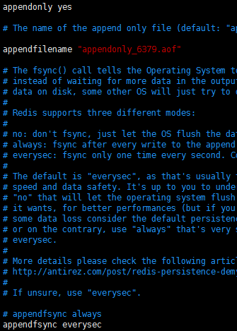
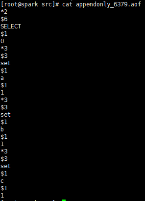

[TOC]

# Redis持久化机制

### 一、持久化的方式

1. RDB持久化。

   RDB持久化方式能够在指定的时间间隔对你的数据进行快照存储。

2. AOF(append only file)持久化。

   AOF持久化方式记录每次对服务器写的操作，当服务器重启的时候会更新执行这些命令来恢复原始的数据。

### 二、RDB方式

1. 客户端直接通过命令BGSAVE或SAVE来创建一个内存快照。

   * BGSAVE调用fork来创建一个子进程，子进程负责将快照写入磁盘，而父进程仍然继续处理命令。
   * SAVE执行SAVE命令的过程中，不再响应其他命令。

2. 在redis.conf中调整save配置选项，当在规定的时间内，Redis发生了写操作的个数满足条件会触发发生BGSAVE命令。

   save 900 1 在900秒检查周期内至少一次写操作。

   save 300 10 300秒检查周期内至少发生10次写操作。

   save 60 10000 60秒检查周期内发生至少10000次写操作。

3. 优缺点。

   |                 优点                 |                             缺点                             |
   | :----------------------------------: | :----------------------------------------------------------: |
   |            对性能影响最小            |                        同步时丢失数据                        |
   | RDB文件进行数据恢复比使用AOF要快得多 | 如果数据集非常大且CPU不够强(比如单核CPU)，Redis在fork子进程时可能会消耗相对较长的时间，影响Redis对外提供服务的能力。 |

### 三、AOF持久化方式

1. 开启AOF持久化。

   appendonly yes

2. AOF策略调整。

   appendfsync always 每次有数据修改发生时都会写入AOF文件。

   appendfsync everysec 每秒钟同步一次，该策略为AOF的缺省策略。

   appendfsync no 从不同步，高效但是数据不会被持久化。

3. 优缺点。

   |     优点     |        缺点         |
   | :----------: | :-----------------: |
   |    最安全    |     文件体积大      |
   |     容灾     |   性能消耗比RDB高   |
   | 易读，可修改 | 数据恢复速度比RDB慢 |

### 四、演示

1. RDB操作演示：

   * 修改redis.conf配置文件，将默认的RDB策略修改为save 3 2，次配置代表如果在每隔3秒的查询周期内，共发生2次数据操作，则进行快照存储。

   * 进行两次数据操作。

     

   * 我们执行一条set c 1命令后，模拟redis故障，插死redsi server后，重新启动。

     

     此时会丢失数据，但是如果是正常的关闭，redis在关闭时会将数据落盘。

2. AOF操作演示：

   * 开启AOF。

     

   * 运行set a 1, set b 1命令。

   * 生成appendonly_6379.aof，其中记录了我们的每次操作。

     

