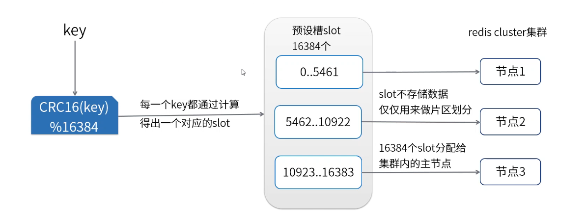
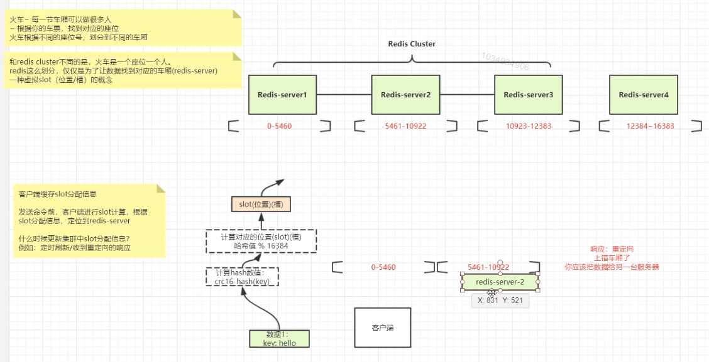

[TOC]

# redis集群分片存储

### 为什么要分片存储

假设公司用户有3千万，用户基本信息缓存到redis中，需要内存10G，如何设计redis的缓存架构？

1. 3千万用户，各种业务场景对用户信息的访问量很大，单台redis实例的读写瓶颈凸显。
2. 单redis实例管理10G内存，必然影响处理效率。
3. redis的内存需求可能超过机器的最大内存，一台机器不够用。

因此就有了分片存储的技术。

### 官方集群方案

redis cluster是Redis的分布式集群解决方案，在3.0版本推出后有效地解决了redis分布式方面的需求，实现了数据在多个redis节点之间自动分片，故障自动转移，扩容机制等功能。






### 搭建集群

1. 环境信息

   centos6，redis5。

2. 集群的信息

   我会在192.168.1.120，192.168.1.122，192.168.1.125这三台机器上分别启动两个redis实例，端口分别是6379和6380。

3. 搭建集群前确保每台机器上都已经安装过redis，我的每台机器上的redis安装目录为：/var/redis-5.0.5。

4. 每台机器上准备两个redis配置文件，一个redis_6379.conf，一个redis_6380.conf。

   ```java
   # 配置文件进行了精简，完整配置可自行和官方提供的完整conf文件进行对照。端口号自行对应修改
   #后台启动的意思
   daemonize yes 
    #端口号
   port 6381
   # IP绑定，redis不建议对公网开放，直接绑定0.0.0.0没毛病
   bind 0.0.0.0
   # redis数据文件存放的目录
   dir /usr/local/redis/data
   # 开启AOF
   appendonly yes
    # 开启集群
   cluster-enabled yes
   # 会自动生成在上面配置的dir目录下
   cluster-config-file nodes-6381.conf 
   cluster-node-timeout 5000
   # 这个文件会自动生成
   pidfile /var/run/redis_6381.pid 
   ```

   

5. 启动6个redis实例，在三台机器的redis的安装目录的src下，分别运行如下两条命令。

   ```java
   ./redis-server ../redis_6379.conf
   ./redis-server ../redis_6380.conf
   ```

   使用ps -ef | grep redis命令查看集群是否启动正常。

   

   

   

6. 创建cluster，在redis安装目录的src下执行下面的命令。

   ```java
   ./redis-cli --cluster create 192.168.1.120:6379 192.168.1.120:6380 192.168.1.122:6379 192.168.1.122:6380 192.168.1.125:6379 192.168.1.125:6380 --cluster-replicas 1
   ```

   在已经使用安装并使用过的redis服务器上运行此命令可能会抛出如下错误。参考https://blog.csdn.net/XIANZHIXIANZHIXIAN/article/details/82777767解决。

   ```java
   [ERR] Node 192.168.1.122:6379 is not empty. Either the node already knows other nodes (check with CLUSTER NODES) or contains some key in database 0.
   ```

   运行成功后会让你确认集群信息。

   ```java
   [root@spark src]# ./redis-cli --cluster create 192.168.1.120:6379 192.168.1.120:6380 192.168.1.122:6379 192.168.1.122:6380 192.168.1.125:6379 192.168.1.125:6380 --cluster-replicas 1
   >>> Performing hash slots allocation on 6 nodes...
   Master[0] -> Slots 0 - 5460
   Master[1] -> Slots 5461 - 10922
   Master[2] -> Slots 10923 - 16383
   Adding replica 192.168.1.122:6380 to 192.168.1.120:6379
   Adding replica 192.168.1.125:6380 to 192.168.1.122:6379
   Adding replica 192.168.1.120:6380 to 192.168.1.125:6379
   M: fd36242496e7a04d883857891ce425a0fc948783 192.168.1.120:6379
      slots:[0-5460] (5461 slots) master
   S: 9ffd15c5674f4ff06ff4dca186fbf919a992c87b 192.168.1.120:6380
      replicates ace69b140e315ce90ed6c19de1aaec73032b1ca6
   M: 77e054f92028a383b69147f0c21e680ae664bb6b 192.168.1.122:6379
      slots:[5461-10922] (5462 slots) master
   S: 1892d6272a759f454548ce97b0d09c580f687ef3 192.168.1.122:6380
      replicates fd36242496e7a04d883857891ce425a0fc948783
   M: ace69b140e315ce90ed6c19de1aaec73032b1ca6 192.168.1.125:6379
      slots:[10923-16383] (5461 slots) master
   S: a4c630716cd013da8a2e2ce89a26127c57ff356e 192.168.1.125:6380
      replicates 77e054f92028a383b69147f0c21e680ae664bb6b
   Can I set the above configuration? (type 'yes' to accept): y
   [root@spark src]# ./redis-cli -c -h 192.168.1.120 -p 6379 cluster nodes
   fd36242496e7a04d883857891ce425a0fc948783 :6379@16379 myself,master - 0 0 0 connected
   [root@spark src]# ./redis-cli -h 192.168.1.120 -p 6379
   192.168.1.120:6379> cluster nodes
   fd36242496e7a04d883857891ce425a0fc948783 :6379@16379 myself,master - 0 0 0 connected
   192.168.1.120:6379> 
   [root@spark src]# ./redis-cli --cluster create 192.168.1.120:6379 192.168.1.120:6380 192.168.1.122:6379 192.168.1.122:6380 192.168.1.125:6379 192.168.1.125:6380 --cluster-replicas 1
   >>> Performing hash slots allocation on 6 nodes...
   Master[0] -> Slots 0 - 5460
   Master[1] -> Slots 5461 - 10922
   Master[2] -> Slots 10923 - 16383
   Adding replica 192.168.1.122:6380 to 192.168.1.120:6379
   Adding replica 192.168.1.125:6380 to 192.168.1.122:6379
   Adding replica 192.168.1.120:6380 to 192.168.1.125:6379
   M: fd36242496e7a04d883857891ce425a0fc948783 192.168.1.120:6379
      slots:[0-5460] (5461 slots) master
   S: 9ffd15c5674f4ff06ff4dca186fbf919a992c87b 192.168.1.120:6380
      replicates ace69b140e315ce90ed6c19de1aaec73032b1ca6
   M: 77e054f92028a383b69147f0c21e680ae664bb6b 192.168.1.122:6379
      slots:[5461-10922] (5462 slots) master
   S: 1892d6272a759f454548ce97b0d09c580f687ef3 192.168.1.122:6380
      replicates fd36242496e7a04d883857891ce425a0fc948783
   M: ace69b140e315ce90ed6c19de1aaec73032b1ca6 192.168.1.125:6379
      slots:[10923-16383] (5461 slots) master
   S: a4c630716cd013da8a2e2ce89a26127c57ff356e 192.168.1.125:6380
      replicates 77e054f92028a383b69147f0c21e680ae664bb6b
   Can I set the above configuration? (type 'yes' to accept): yes
   >>> Nodes configuration updated
   >>> Assign a different config epoch to each node
   >>> Sending CLUSTER MEET messages to join the cluster
   Waiting for the cluster to join
   ...
   >>> Performing Cluster Check (using node 192.168.1.120:6379)
   M: fd36242496e7a04d883857891ce425a0fc948783 192.168.1.120:6379
      slots:[0-5460] (5461 slots) master
      1 additional replica(s)
   M: ace69b140e315ce90ed6c19de1aaec73032b1ca6 192.168.1.125:6379
      slots:[10923-16383] (5461 slots) master
      1 additional replica(s)
   S: 9ffd15c5674f4ff06ff4dca186fbf919a992c87b 192.168.1.120:6380
      slots: (0 slots) slave
      replicates ace69b140e315ce90ed6c19de1aaec73032b1ca6
   S: a4c630716cd013da8a2e2ce89a26127c57ff356e 192.168.1.125:6380
      slots: (0 slots) slave
      replicates 77e054f92028a383b69147f0c21e680ae664bb6b
   S: 1892d6272a759f454548ce97b0d09c580f687ef3 192.168.1.122:6380
      slots: (0 slots) slave
      replicates fd36242496e7a04d883857891ce425a0fc948783
   M: 77e054f92028a383b69147f0c21e680ae664bb6b 192.168.1.122:6379
      slots:[5461-10922] (5462 slots) master
      1 additional replica(s)
   [OK] All nodes agree about slots configuration.
   >>> Check for open slots...
   >>> Check slots coverage...
   [OK] All 16384 slots covered.
   
   ```

   

   7. 集群检验和测试

      查看所有节点信息。

      ```java
      [root@spark src]# ./redis-cli -c -h 192.168.1.120 -p 6379 cluster nodes
      ace69b140e315ce90ed6c19de1aaec73032b1ca6 192.168.1.125:6379@16379 master - 0 1561421002080 5 connected 10923-16383
      9ffd15c5674f4ff06ff4dca186fbf919a992c87b 192.168.1.120:6380@16380 slave ace69b140e315ce90ed6c19de1aaec73032b1ca6 0 1561421000463 5 connected
      fd36242496e7a04d883857891ce425a0fc948783 192.168.1.120:6379@16379 myself,master - 0 1561421000000 1 connected 0-5460
      a4c630716cd013da8a2e2ce89a26127c57ff356e 192.168.1.125:6380@16380 slave 77e054f92028a383b69147f0c21e680ae664bb6b 0 1561421000160 6 connected
      1892d6272a759f454548ce97b0d09c580f687ef3 192.168.1.122:6380@16380 slave fd36242496e7a04d883857891ce425a0fc948783 0 1561420999891 4 connected
      77e054f92028a383b69147f0c21e680ae664bb6b 192.168.1.122:6379@16379 master - 0 1561421001081 3 connected 5461-10922
      
      # 开启客户端不加-c选项，如果当前数据不应该在此实例上会返回MOVED
      ./redis-cli -h 192.168.1.120 -p 6379
      192.168.1.120:6379> set a 1
      (error) MOVED 15495 192.168.1.125:6379
      192.168.1.120:6379> 
      
      # 开启的话会为当前的数据自动跳转到对应的实例
      [root@spark src]# ./redis-cli -h 192.168.1.120 -p 6379
      192.168.1.120:6379> set a 1
      (error) MOVED 15495 192.168.1.125:6379
      192.168.1.120:6379> 
      [root@spark src]# ./redis-cli -c -h 192.168.1.120 -p 6379
      192.168.1.120:6379> set a 1
      -> Redirected to slot [15495] located at 192.168.1.125:6379
      OK
      192.168.1.125:6379> get a
      "1"
      192.168.1.125:6379> set hello tony
      -> Redirected to slot [866] located at 192.168.1.120:6379
      OK
      192.168.1.120:6379> get a
      -> Redirected to slot [15495] located at 192.168.1.125:6379
      "1"
      192.168.1.125:6379> cluster keyslot a
      (integer) 15495
      192.168.1.125:6379> 
      ```

   8. 集群slot数量整理reshard

      ```java
      # 有时根据集群中的机器的配置，我们可能希望有些性能高的机器上的槽多一些
      # 就可以使用reshard,下面我们从192.168.1.120服务器移动1000个slot到192.168.1.122
      # 这台服务器上
      ./redis-cli --cluster reshard 192.168.1.120:6379 --cluster-from fd36242496e7a04d883857891ce425a0fc948783 --cluster-to 77e054f92028a383b69147f0c21e680ae664bb6b --cluster-slots 1000 --cluster-yes
      
      # 运行后会有如下输出
      Moving slot 714 from 192.168.1.120:6379 to 192.168.1.122:6379: 
      Moving slot 715 from 192.168.1.120:6379 to 192.168.1.122:6379: 
      
      # 重新检查集群
      ./redis-cli --cluster check 192.168.1.120:6379
          
      M: fd36242496e7a04d883857891ce425a0fc948783 192.168.1.120:6379
         slots:[1000-5460] (4461 slots) master
         1 additional replica(s)
      M: ace69b140e315ce90ed6c19de1aaec73032b1ca6 192.168.1.125:6379
         slots:[10923-16383] (5461 slots) master
         1 additional replica(s)
      S: 9ffd15c5674f4ff06ff4dca186fbf919a992c87b 192.168.1.120:6380
         slots: (0 slots) slave
         replicates ace69b140e315ce90ed6c19de1aaec73032b1ca6
      S: a4c630716cd013da8a2e2ce89a26127c57ff356e 192.168.1.125:6380
         slots: (0 slots) slave
         replicates 77e054f92028a383b69147f0c21e680ae664bb6b
      S: 1892d6272a759f454548ce97b0d09c580f687ef3 192.168.1.122:6380
         slots: (0 slots) slave
         replicates fd36242496e7a04d883857891ce425a0fc948783
      M: 77e054f92028a383b69147f0c21e680ae664bb6b 192.168.1.122:6379
         slots:[0-999],[5461-10922] (6462 slots) master
         1 additional replica(s)
      [OK] All nodes agree about slots configuration.
      >>> Check for open slots...
      >>> Check slots coverage...
      [OK] All 16384 slots covered.
      # 可以看出从192.168.1.120移动了1000个slot到192.168.1.122
      ```

   9. 测试自动故障转移

      ```java
      # cluster集群不保证数据一致，数据也可能丢失
      # 首先是运行客户端不断的写入或读取数据，以便能够发现问题
      # 然后是模拟节点故障：找一个主节点关闭，主从故障切换的过程中，这个时间端的操作，客户端而言，只能是失败
      # 官方描述 https://redis.io/topics/cluster-spec  
      There is always a window of time when it is possible to lose writes during partitions.
      分区的时间窗口内总是有可能丢失写操作。
      
      # 将192.168.1.120:6379这个实例停掉，192.168.1.122:6380成为一个master
       ./redis-cli -c -h 192.168.1.120 -p 6379
      192.168.1.120:6379> shutdown
      not connected> set a 1 [expiration EX seconds|PX milliseconds] [NX|XX]
      [root@spark src]# ./redis-cli --cluster check 192.168.1.120:6380
      Could not connect to Redis at 192.168.1.120:6379: Connection refused
      192.168.1.125:6379 (ace69b14...) -> 1 keys | 5461 slots | 1 slaves.
      192.168.1.122:6380 (1892d627...) -> 0 keys | 4461 slots | 0 slaves.
      192.168.1.122:6379 (77e054f9...) -> 1 keys | 6462 slots | 1 slaves.
      [OK] 2 keys in 3 masters.
      0.00 keys per slot on average.
      >>> Performing Cluster Check (using node 192.168.1.120:6380)
      S: 9ffd15c5674f4ff06ff4dca186fbf919a992c87b 192.168.1.120:6380
         slots: (0 slots) slave
         replicates ace69b140e315ce90ed6c19de1aaec73032b1ca6
      M: ace69b140e315ce90ed6c19de1aaec73032b1ca6 192.168.1.125:6379
         slots:[10923-16383] (5461 slots) master
         1 additional replica(s)
      M: 1892d6272a759f454548ce97b0d09c580f687ef3 192.168.1.122:6380
         slots:[1000-5460] (4461 slots) master
      M: 77e054f92028a383b69147f0c21e680ae664bb6b 192.168.1.122:6379
         slots:[0-999],[5461-10922] (6462 slots) master
         1 additional replica(s)
      S: a4c630716cd013da8a2e2ce89a26127c57ff356e 192.168.1.125:6380
         slots: (0 slots) slave
         replicates 77e054f92028a383b69147f0c21e680ae664bb6b
      [OK] All nodes agree about slots configuration.
      >>> Check for open slots...
      >>> Check slots coverage...
      [OK] All 16384 slots covered.
      [root@spark src]# 
      
      # 查看此时的集群信息，192.168.1.120:6379下线了
      [root@spark src]# ./redis-cli -c -h 192.168.1.120 -p 6380
      192.168.1.120:6380> cluster nodes
      fd36242496e7a04d883857891ce425a0fc948783 192.168.1.120:6379@16379 master,fail - 1561422523649 1561422523348 1 disconnected
      ace69b140e315ce90ed6c19de1aaec73032b1ca6 192.168.1.125:6379@16379 master - 0 1561422691644 5 connected 10923-16383
      1892d6272a759f454548ce97b0d09c580f687ef3 192.168.1.122:6380@16380 master - 0 1561422693669 8 connected 1000-5460
      77e054f92028a383b69147f0c21e680ae664bb6b 192.168.1.122:6379@16379 master - 0 1561422693570 7 connected 0-999 5461-10922
      9ffd15c5674f4ff06ff4dca186fbf919a992c87b 192.168.1.120:6380@16380 myself,slave ace69b140e315ce90ed6c19de1aaec73032b1ca6 0 1561422687000 2 connected
      a4c630716cd013da8a2e2ce89a26127c57ff356e 192.168.1.125:6380@16380 slave 77e054f92028a383b69147f0c21e680ae664bb6b 0 1561422692148 7 connected
      192.168.1.120:6380> 
      
      # 如果再把192.168.1.120:6379启动起来，其会议salve的身份加入集群
      [root@spark src]# ./redis-cli --cluster check 192.168.1.120:6380
      192.168.1.125:6379 (ace69b14...) -> 1 keys | 5461 slots | 1 slaves.
      192.168.1.122:6380 (1892d627...) -> 0 keys | 4461 slots | 1 slaves.
      192.168.1.122:6379 (77e054f9...) -> 1 keys | 6462 slots | 1 slaves.
      [OK] 2 keys in 3 masters.
      0.00 keys per slot on average.
      >>> Performing Cluster Check (using node 192.168.1.120:6380)
      S: 9ffd15c5674f4ff06ff4dca186fbf919a992c87b 192.168.1.120:6380
         slots: (0 slots) slave
         replicates ace69b140e315ce90ed6c19de1aaec73032b1ca6
      S: fd36242496e7a04d883857891ce425a0fc948783 192.168.1.120:6379
         slots: (0 slots) slave
         replicates 1892d6272a759f454548ce97b0d09c580f687ef3
      M: ace69b140e315ce90ed6c19de1aaec73032b1ca6 192.168.1.125:6379
         slots:[10923-16383] (5461 slots) master
         1 additional replica(s)
      M: 1892d6272a759f454548ce97b0d09c580f687ef3 192.168.1.122:6380
         slots:[1000-5460] (4461 slots) master
         1 additional replica(s)
      M: 77e054f92028a383b69147f0c21e680ae664bb6b 192.168.1.122:6379
         slots:[0-999],[5461-10922] (6462 slots) master
         1 additional replica(s)
      S: a4c630716cd013da8a2e2ce89a26127c57ff356e 192.168.1.125:6380
         slots: (0 slots) slave
         replicates 77e054f92028a383b69147f0c21e680ae664bb6b
      [OK] All nodes agree about slots configuration.
      >>> Check for open slots...
      >>> Check slots coverage...
      [OK] All 16384 slots covered.
      
      ```

   10. 手动故障转移

       ```java
       # 可能某个节点需要维护(机器下线，硬件升级，系统版本调整等场景)，需要手动的实现转移
       # 在slave节点上执行命令
       CLUSTER FAILOVER
       # 相比较于自动故障转移而言，手动故障转移不会丢失数据
       ```

       ```java
       # 上面我们手动将192.168.1.120:6379上的redis服务停掉再起来后，它以slave的身份加入
       # 集群，现在我们想让它重新成为master
       [root@spark src]# ./redis-cli -c -h 192.168.1.120 -p 6379
       # 查看当前集群信息
       192.168.1.120:6379> cluster nodes
       1892d6272a759f454548ce97b0d09c580f687ef3 192.168.1.122:6380@16380 master - 0 1561423733576 8 connected 1000-5460
       ace69b140e315ce90ed6c19de1aaec73032b1ca6 192.168.1.125:6379@16379 slave 9ffd15c5674f4ff06ff4dca186fbf919a992c87b 0 1561423734623 9 connected
       a4c630716cd013da8a2e2ce89a26127c57ff356e 192.168.1.125:6380@16380 slave 77e054f92028a383b69147f0c21e680ae664bb6b 0 1561423734084 7 connected
       9ffd15c5674f4ff06ff4dca186fbf919a992c87b 192.168.1.120:6380@16380 master - 0 1561423735107 9 connected 10923-16383
       77e054f92028a383b69147f0c21e680ae664bb6b 192.168.1.122:6379@16379 master - 0 1561423734620 7 connected 0-999 5461-10922
       fd36242496e7a04d883857891ce425a0fc948783 192.168.1.120:6379@16379 myself,slave 1892d6272a759f454548ce97b0d09c580f687ef3 0 1561423733000 1 connected
       # 执行手动故障转移
       192.168.1.120:6379> cluster failover
       OK
       # 检查手动故障转移效果，发现192.168.1.120:6379再次成为master
       192.168.1.120:6379> cluster nodes
       1892d6272a759f454548ce97b0d09c580f687ef3 192.168.1.122:6380@16380 slave fd36242496e7a04d883857891ce425a0fc948783 0 1561423750936 10 connected
       ace69b140e315ce90ed6c19de1aaec73032b1ca6 192.168.1.125:6379@16379 slave 9ffd15c5674f4ff06ff4dca186fbf919a992c87b 0 1561423751000 9 connected
       a4c630716cd013da8a2e2ce89a26127c57ff356e 192.168.1.125:6380@16380 slave 77e054f92028a383b69147f0c21e680ae664bb6b 0 1561423750000 7 connected
       9ffd15c5674f4ff06ff4dca186fbf919a992c87b 192.168.1.120:6380@16380 master - 0 1561423751955 9 connected 10923-16383
       77e054f92028a383b69147f0c21e680ae664bb6b 192.168.1.122:6379@16379 master - 0 1561423750432 7 connected 0-999 5461-10922
       fd36242496e7a04d883857891ce425a0fc948783 192.168.1.120:6379@16379 myself,master - 0 1561423751000 10 connected 1000-5460
       192.168.1.120:6379> 
       ```

   11. 扩容

       ```java
       # 我们再在192.168.1.120这台服务器上准备一个redis配置文件，redis_6381.conf
       # 启动新节点
       ./redis-server ../redis_6381.conf
       
       # 以master身份加入集群
       ./redis-cli --cluster add-node 192.168.1.120:6381 192.168.1.120:6379
       >>> Adding node 192.168.1.120:6381 to cluster 192.168.1.120:6379
       >>> Performing Cluster Check (using node 192.168.1.120:6379)
       M: fd36242496e7a04d883857891ce425a0fc948783 192.168.1.120:6379
          slots:[1000-5460] (4461 slots) master
          1 additional replica(s)
       S: 1892d6272a759f454548ce97b0d09c580f687ef3 192.168.1.122:6380
          slots: (0 slots) slave
          replicates fd36242496e7a04d883857891ce425a0fc948783
       S: ace69b140e315ce90ed6c19de1aaec73032b1ca6 192.168.1.125:6379
          slots: (0 slots) slave
          replicates 9ffd15c5674f4ff06ff4dca186fbf919a992c87b
       S: a4c630716cd013da8a2e2ce89a26127c57ff356e 192.168.1.125:6380
          slots: (0 slots) slave
          replicates 77e054f92028a383b69147f0c21e680ae664bb6b
       M: 9ffd15c5674f4ff06ff4dca186fbf919a992c87b 192.168.1.120:6380
          slots:[10923-16383] (5461 slots) master
          1 additional replica(s)
       M: 77e054f92028a383b69147f0c21e680ae664bb6b 192.168.1.122:6379
          slots:[0-999],[5461-10922] (6462 slots) master
          1 additional replica(s)
       [OK] All nodes agree about slots configuration.
       >>> Check for open slots...
       >>> Check slots coverage...
       [OK] All 16384 slots covered.
       >>> Send CLUSTER MEET to node 192.168.1.120:6381 to make it join the cluster.
       [OK] New node added correctly.
       # 查看此时的集群信息，新创建的redis实例以master身份加入集群
       [root@spark src]# ./redis-cli -c -h 192.168.1.120 -p 6379
       192.168.1.120:6379> cluster nodes
       12593a9cfbdffd272547926b625acb09d306c7fc 192.168.1.120:6381@16381 master - 0 1561424739585 0 connected
       1892d6272a759f454548ce97b0d09c580f687ef3 192.168.1.122:6380@16380 slave fd36242496e7a04d883857891ce425a0fc948783 0 1561424739488 10 connected
       ace69b140e315ce90ed6c19de1aaec73032b1ca6 192.168.1.125:6379@16379 slave 9ffd15c5674f4ff06ff4dca186fbf919a992c87b 0 1561424740528 9 connected
       a4c630716cd013da8a2e2ce89a26127c57ff356e 192.168.1.125:6380@16380 slave 77e054f92028a383b69147f0c21e680ae664bb6b 0 1561424740529 7 connected
       9ffd15c5674f4ff06ff4dca186fbf919a992c87b 192.168.1.120:6380@16380 master - 0 1561424740628 9 connected 10923-16383
       77e054f92028a383b69147f0c21e680ae664bb6b 192.168.1.122:6379@16379 master - 0 1561424740019 7 connected 0-999 5461-10922
       fd36242496e7a04d883857891ce425a0fc948783 192.168.1.120:6379@16379 myself,master - 0 1561424738000 10 connected 1000-5460
       192.168.1.120:6379> 
       # 本质就是发送一个新节点通过CLUSTER MEET命令加入集群
       # 注意新加入的节点是没有分配slot的，它不会存储数据，我们使用之前需要给它分配slot
       # 参考第8点
       
       # 以slave身份加入集群
       ./redis-cli --cluster add-node 192.168.1.120:6381 192.168.1.120:6379 --cluster-slave
       # 还可以手动指定要以slave身份加入集群的节点的master节点，否则就选择一个slave数量
       # 最少的master
       ./redis-cli --cluster add-node 192.168.1.120:6381 192.168.1.120:6379 --cluster-slave --cluster-master-id <node-id>
       # 将空master转换为slave
       cluster replicate <master-node-id>
       ```

   12. 缩容

       ```java
       # 注意：删除master的时候要把数据清空或者分配给其他主节点
       # 下面我们将新加入的192.168.1.120:6381节点删除
       [root@spark src]# ./redis-cli --cluster del-node 192.168.1.120:6381 12593a9cfbdffd272547926b625acb09d306c7fc
       >>> Removing node 12593a9cfbdffd272547926b625acb09d306c7fc from cluster 192.168.1.120:6381
       >>> Sending CLUSTER FORGET messages to the cluster...
       >>> SHUTDOWN the node.
       # 查看6381对应的redis进程是否还在
       [root@spark src]# ps -ef | grep redis
       root     17475 17274  0 07:53 pts/1    00:00:34 ./redis-server 192.168.1.120:6380 [cluster]
       root     17503 17228  0 08:33 pts/0    00:00:18 ./redis-server 192.168.1.120:6379 [cluster]
       root     17571 17303  0 09:17 pts/3    00:00:00 grep redis
       [root@spark src]# 
       ```

### 集群关心的问题

   1. 增加了slot槽位的计算，是不是比单机性能差？

      共16384个槽位，slots槽计算方式公开的，HASH_SLOT = CRC(key) mod 16384。为了避免每次都需要服务器计算重定向，优秀的java客户端都实现了本地计算，并且缓存服务器slots分配，有变动时再更新本地内容，从而避免了多次重定向带来的性能损耗。

   2. redis集群大小，到底可以装多少数据？

      理论是可以做到16384个槽，每个槽对应一个实例，但是redis官方建议是最大1000个实例。

   3. 集群节点间是怎么通信的？

      每个redis集群节点都有一个额外的TCP端口，每个节点使用TCP连接与其他节点连接。检测和故障转移这些步骤基本和哨兵模式类似。

   4. ask和moved重定向的区别。

      重定向包括两种情况：

      * 若确定slot不属于当前节点，redis会返回moved。
      * 若当前redis节点正在处理slot迁移，则代表此处请求对应的key暂时不在此节点，返回ask，告诉客户端本次请求重定向。
      
5. 数据倾斜和访问倾斜的问题。

   倾斜导致集群中部分节点数据多，压力大。解决方案分为前期和后期：

   * 前期是业务层面提前预测，哪些是热点key，在设计的过程中规避。

   * 后期是slot迁移，尽量将压力分摊(slot调整有自动reblance，reshard和手动)。
   
6. slot手动迁移怎么做？

   * 在迁移目的节点执行cluster setslot <slot> IMPORTING <node ID>命令，指明需要迁移的slot和迁移源节点。
   * 在迁移源节点执行cluster setslot <slot> MIGRATING <node ID>命令，指明需要迁移的slot和迁移目的节点。
   * 在迁移源节点执行cluster getkeysinslot获取该slot的key列表。
   * 在迁移源节点对每个key执行migrate命令，该命令会同步把该key迁移到目的节点。
   * 在迁移源节点返回执行cluster getkeysinslot命令，直到该slot的列表为空。
   * 在迁移源节点和目的节点执行cluster setslot <slot> NODE <node ID>，完成迁移操作。
   
7. 节点之间会交换信息，传递的消息包括槽的信息，带来带宽消耗。避免使用大的集群，可以分多个集群。

8. Pub/Sub发布订阅机制，对集群内任意一个节点执行publish发布消息，这个消息会在集群中进行传播，其他节点接收到发布的消息。

9. 读写分离。

   * redis-cluster默认所有从节点上的读写，都会重定向到key对接槽的主节点上。
   * 可以通过readonly设置当前连接可读，通过readwrite取消当前连接的可读状态。
   * 主从节点依然存在数据不一致的问题。

### Java客户端代码

1. 配置Bean。

   ```java
   @Configuration
   // 在cluster环境下生效
   @Profile("a7_cluster")
   class ClusterAppConfig {
       @Bean
       public JedisConnectionFactory redisConnectionFactory() {
           System.out.println("加载cluster环境下的redis client配置");
           RedisClusterConfiguration redisClusterConfiguration = new RedisClusterConfiguration(Arrays.asList(
                   "192.168.1.120:6379",
                   "192.168.1.120:6380",
                   "192.168.1.122:6379",
                   "192.168.1.122:6380",
                   "192.168.1.125:6379",
                   "192.168.1.125:6380"
           ));
           // 自适应集群变化
           return new JedisConnectionFactory(redisClusterConfiguration);
       }
   }
   ```

2. 业务service。

   ```java
   @Service
   @Profile("a7_cluster")
   public class ClusterService {
       @Autowired
       private StringRedisTemplate template;
   
       public void set(String userId, String userInfo) {
           template.opsForValue().set(userId, userInfo);
       }
   }
   ```

3. 单元测试

   ```java
   @RunWith(SpringJUnit4ClassRunner.class)
   @ContextConfiguration("classpath:applicationContext.xml")
   @ActiveProfiles("a7_cluster") // 设置profile
   // 集群对于客户端而言，基本是无感知的
   public class ClusterServiceTests {
       @Autowired
       ClusterService clusterService;
   
       @Test
       public void setTest() {
           clusterService.set("tony", "hahhhhh");
           clusterService.set("a", "1");
           clusterService.set("foo", "bar");
       }
   
       // 测试cluster集群故障时的反应
       @Test
       public void failoverTest() {
           while (true) {
               try {
                   long i = System.currentTimeMillis();
                   clusterService.set("tony", i + "");
                   // delay 10ms
                   TimeUnit.MILLISECONDS.sleep(10);
               } catch (Exception e) {
                   System.out.println(e.getMessage());
               }
           }
       }
   }
   
   运行setTest后，它实际上存储在192.168.1.120:6380
   ./redis-cli -c -h 192.168.1.120 -p 6379
   192.168.1.120:6379> get tony
   -> Redirected to slot [14405] located at 192.168.1.120:6380
   "hahhhhh"
   192.168.1.120:6380> get tongy
   -> Redirected to slot [9429] located at 192.168.1.122:6379
   (nil)
   192.168.1.122:6379> get tony
   -> Redirected to slot [14405] located at 192.168.1.120:6380
   "hahhhhh"
   192.168.1.120:6380
       
   运行failoverTest后，停掉192.168.1.120:6380
   192.168.1.120:6380> shutdown
   not connected> 
   对客户端无影响
   ```

### 非官方集群方案

1. Codis，豌豆荚开源。
2. twemproxy，推特开源。