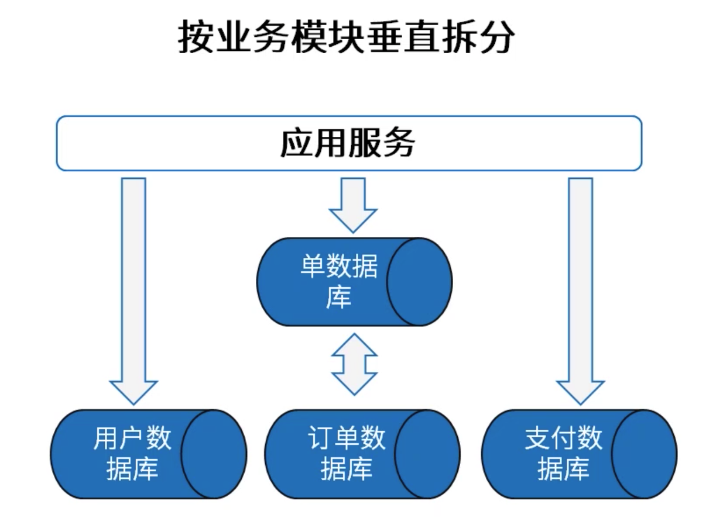
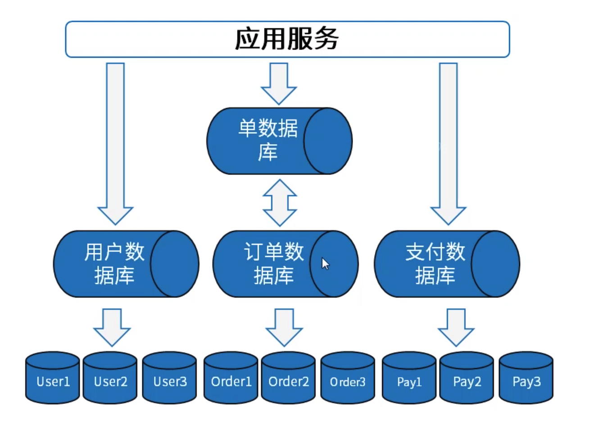
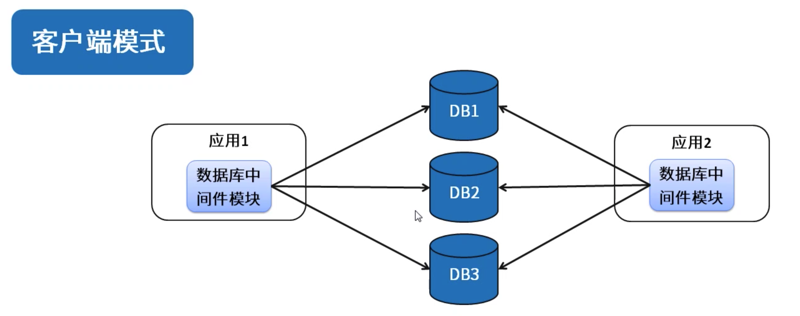
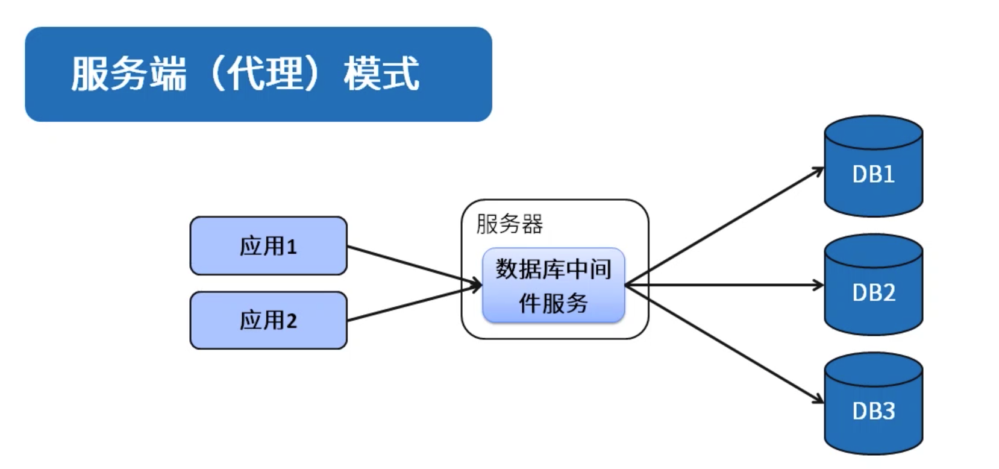
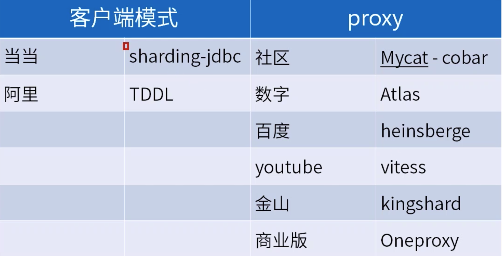
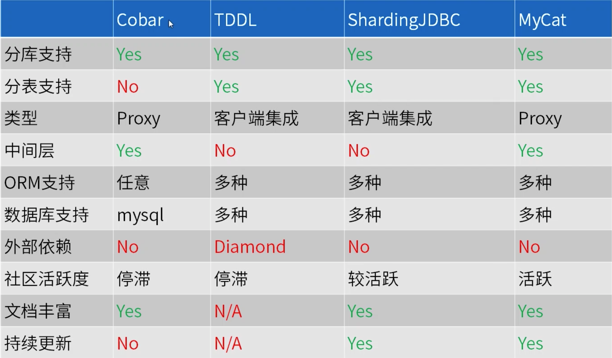

[TOC]

# 数据库中间件设计要点

### 数据库中间件设计要点

1. 要能解析SQL。
2. 能支持读写分离。
3. 能支持从库读的负载均衡。
4. 支持分库操作。
5. 支持分表操作。
6. 支持跨库关联查询。
7. 对事务处理的支持。
8. 主键ID生成。
9. 数据源管理。

### 数据库拆分-垂直拆分

1. 优点
   * 拆分后业务清晰，拆分规则明确。
   * 系统之间整合或扩展容易。
   * 数据维护简单。
2. 缺点
   * 部分业务表无法join，只能通过接口方式解决，提高了系统的复杂性。
   * 受每种业务不同的限制存在单库性能瓶颈，不易数据扩展跟性能提高。
   * 事务处理复杂。

### 数据库拆分-水平拆分

对海量数据的表进行分库分表存储。

1. 优点
   * 拆分规则抽象好，join操作基本可以在数据库做。
   * 不存在单库大数据，高并发性能瓶颈。
   * 应用端改造少。
   * 提高了系统的稳定性跟负载能力。
2. 缺点
   * 拆分规则难以抽象。
   * 分片事务一致性难以解决。
   * 数据多次扩展难度跟维护量极大。
   * 跨库join性能较差。

### 水平拆分-分片规则

水平对数据进行拆分最重要的是分片规则-拆分规则。

1. 范围：时间，数值。
2. 列表：按地域，按组织，分类。
3. 散列：hash(某个字段)%分片数，一致性hash。
4. 复合多种方式。

### 分库分表的技术难点

无论垂直拆分，水平拆分，都有共同的技术难点。

1. 引入分布式事务的问题。
2. 跨节点join的问题。
3. 跨节点合并排序分页问题。
4. 多数据源管理问题。

### 数据库中间件的两种实现模式

1. 客户端模式

   在应用程序中集成数据库中间件模块，通过该模块来配置管理应用需要的一个或者多个数据源，以及访问各个数据源，在模块内完成数据的整个。

   

2. 服务端代理模式

   通过中间代理层来统一管理所有的数据源，后端数据库集群对前端应用程序透明，同时易于数据库扩展。独立的服务能提供更强的处理能力。适用于大型复杂系统。
   
   

### 常用数据库中间件简介

 

